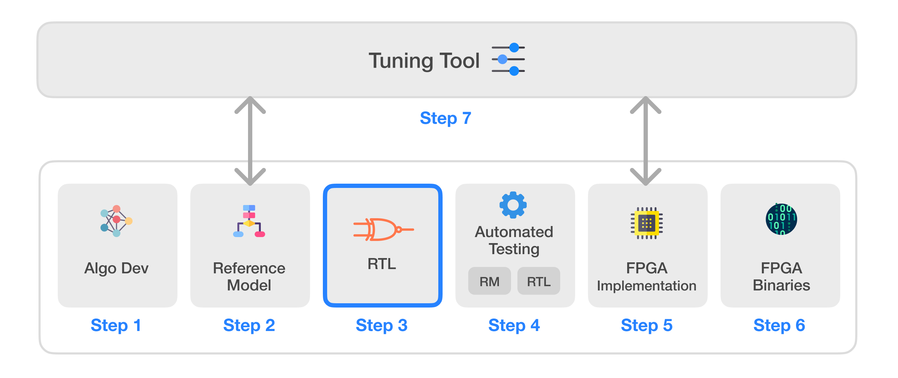

# Infinite-ISP
Infinite-ISP is a full-stack ISP development platform - from algorithm development to RTL design, FPGA/ASIC implementation, and associated firmware, tools, etc. It offers a unified platform that empowers ISP developers to accelerate ISP innovation. It includes a complete collection of camera pipeline modules written in Python, its associated fixed-point reference model, an optimized RTL design, an FPGA bitstream & the associated Firmware for the implementation of the pipeline on the Kria KV260 development board, and lastly, a stand-alone Python-based Tuning Tool application for the pipeline. The main components of the Infinite-ISP project are listed below:

| Sr.     | Repository name        | Description      | 
|---------| -------------  | ------------- |
| 1  | **[Infinite-ISP_AlgorithmDesign](https://github.com/10x-Engineers/Infinite-ISP)**   | Python based model of the Infinite-ISP pipeline for algorithm development |
| 2  | **[Infinite-ISP_ReferenceModel](https://github.com/10x-Engineers/Infinite-ISP_ReferenceModel)**                      | Python based fixed-point model of the Infinite-ISP pipeline for hardware implementation |
| 3  | **[Infinite-ISP_RTL](https://github.com/10x-Engineers/Infinite-ISP_RTL)** | RTL Verilog design of the image signal processor based on the Reference Model **[(Request Access)](https://docs.google.com/forms/d/e/1FAIpQLSfOIldU_Gx5h1yQEHjGbazcUu0tUbZBe0h9IrGcGljC5b4I-g/viewform?usp=sharing)** |
| 4  | **[Infinite-ISP_Automated_Testing](https://github.com/10x-Engineers/Infinite-ISP_Automated_Testing)** | A framework to enable the automated block and multi-block level testing of the image signal processor to ensure a bit accurate design |
| 5  | **FPGA Implementation** | FPGA implementation of Infinite-ISP on    <ul><li>Xilinx® Kria KV260’s XCK26 Zynq UltraScale + MPSoC **[Infinite-ISP_FPGA_XCK26](https://github.com/10x-Engineers/Infinite-ISP_FPGA_XCK26)**</li></ul>   |
| 6  | **[Infinite-ISP_FPGABinaries](https://github.com/10x-Engineers/Infinite-ISP_FPGABinaries)**         | FPGA binaries (bitstream + firmware executable) for the Xilinx® Kria KV260’s XCK26 Zynq UltraScale + MPSoC|
| 7  | **[Infinite-ISP_TuningTool](https://github.com/10x-Engineers/Infinite-ISP_TuningTool)**                              | Collection of calibration and analysis tools for the Infinite-ISP |
| 8  | **[Infinite-ISP_LinuxCameraStack](https://github.com/10x-Engineers/Infinite-ISP_LinuxCameraStack.git)** :anchor: | Linux-based camera stack developed using the libcamera platform and integrated the Infinite-ISP for the Xilinx® Kria board. |

# Infinite-ISP Linux Based Camera Stack
A camera stack featuring libcamera-based applications, utilizing Infinite-ISP on the Xilinx® Kria KV260’s XCK26 Zynq UltraScale + MPSoC.

Comming Soon!

## License 
This project is licensed under Apache 2.0 (see [LICENSE](LICENSE) file).

## Contact
For any inquiries or feedback, feel free to reach out.

Email: isp@10xengineers.ai

Website: http://www.10xengineers.ai

LinkedIn: https://www.linkedin.com/company/10x-engineers/