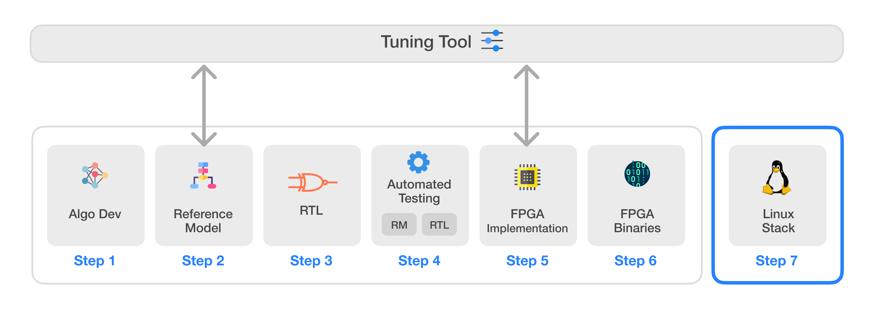

# Infinite-ISP
Infinite-ISP is a full-stack ISP development platform designed for all aspects of a hardware ISP. It includes a collection of camera pipeline modules written in Python, a fixed-point reference model, an optimized RTL design, an FPGA integration framework and its associated firmware ready for Xilinx® Kria KV260 development board. The platform features a stand-alone Python-based Tuning Tool that allows tuning of ISP parameters for different sensors and applications. Finally, it also offers a software solution for Linux by providing required drivers and a custom application development stack to bring Infinite-ISP to the Linux platforms.

| Sr.     | Repository name        | Description      | 
|---------| -------------  | ------------- |
| 1  | **[Infinite-ISP_AlgorithmDesign](https://github.com/10x-Engineers/Infinite-ISP)**   | Python based model of the Infinite-ISP pipeline for algorithm development |
| 2  | **[Infinite-ISP_ReferenceModel](https://github.com/10x-Engineers/Infinite-ISP_ReferenceModel)**    | Python based fixed-point model of the Infinite-ISP pipeline for hardware implementation |
| 3  | **[Infinite-ISP_RTL](https://github.com/10x-Engineers/Infinite-ISP_RTL)**  | RTL Verilog design of the image signal processor based on the Reference Model |
| 4  | **[Infinite-ISP_AutomatedTesting](https://github.com/10x-Engineers/Infinite-ISP_AutomatedTesting)** | A framework to enable the automated block and multi-block level testing of the image signal processor to ensure a bit accurate design |
| 5  | **FPGA Implementation**  | FPGA implementation of Infinite-ISP on    <ul><li>Xilinx® Kria KV260’s XCK26 Zynq UltraScale + MPSoC **[Infinite-ISP_FPGA_XCK26](https://github.com/10x-Engineers/Infinite-ISP_FPGA_XCK26)** </li></ul>   |
| 6  | **[Infinite-ISP_FPGABinaries](https://github.com/10x-Engineers/Infinite-ISP_FPGABinaries)**         | FPGA binaries (bitstream + firmware executable) for the Xilinx® Kria KV260’s XCK26 Zynq UltraScale + MPSoC|
| 7  | **[Infinite-ISP_TuningTool](https://github.com/10x-Engineers/Infinite-ISP_TuningTool)**                              | Collection of calibration and analysis tools for the Infinite-ISP |
| 8  | **[Infinite-ISP_LinuxCameraStack](https://github.com/10x-Engineers/Infinite-ISP_LinuxCameraStack.git)** :anchor: | Extending Linux support to Infinite-ISP and the developement of Linux-based camera application stack |

**[Request Access](https://docs.google.com/forms/d/e/1FAIpQLSfOIldU_Gx5h1yQEHjGbazcUu0tUbZBe0h9IrGcGljC5b4I-g/viewform?usp=sharing)** to **Infinite-ISP_RTL, Infinite-ISP_AutomatedTesting** and **Infinite-ISP_FPGA_XCK26** repositories

# Infinite-ISP Linux Based Camera Stack
## Overview
The **Infinite-ISP Linux-Based Camera Stack** is an open-source platform with the primary goal of providing a complete stack for camera software development. It aims to utilize the Infinite-ISP as an image processing pipeline on the FPGA through Linux and leverage the ***libcamera*** framework for custom camera application development in user space. This approach will enable the Infinite-ISP on the FPGA to offer greater flexibility, scalability, and ease of development.

**Note:** This project is currently under development and is open for contributions.

Developing a camera stack involves several steps, such as creating custom camera applications, implementing the hardware ISP on the FPGA, and establishing the interface between hardware and software layers through Linux. Some of these steps have already been accomplished, while others are still in progress:

## Accomplished
* [Custom Camera Applications](/Camera%20Application/burst_cam_application/): A custom camera application has been developed using the libcamera framework that is capable of capturing and processing single and multiple consective frames in user space.

* [FPGA Implementation](https://github.com/10x-Engineers/Infinite-ISP_FPGA_XCK26): The Infinite-ISP has been successfully implemented on the FPGA of the Xilinx® Kria KV260's XCK26 Zynq UltraScale + MPSoC.

## Under Development

### [Infinite-ISP Driver](/Infinite-ISP%20Driver/)
The driver is currently under development, and we are seeking open-source contributions to assist in its creation. There are two issues related to this that need to be addressed. 

* Issue # 1: Integrate the Infinite-ISP into the Linux operating system as a module.
* Issue # 2: Develop the driver for Infinite-ISP to enable seamless communication between the hardware and software layers.

Together, all these components enable any libcamera-based camera application to operate on the Infinite-ISP FPGA hardware using Linux.  

## How to Contribute
**Want to help develop the driver for Infinite-ISP?**

Dive into the [Ininite-ISP Driver](/Infinite-ISP%20Driver/) directory, where you'll find all the materials related to the challenges we're tackling. The [README](/Infinite-ISP%20Driver/README.md) file provides a step-by-step guide on how you can use these resources and start contributing. Your expertise and creativity are welcome! 

## License 
This project is licensed under Apache 2.0 (see [LICENSE](LICENSE) file).

## Contact
For any inquiries or feedback, feel free to reach out.

Email: isp@10xengineers.ai

Website: http://www.10xengineers.ai

LinkedIn: https://www.linkedin.com/company/10x-engineers/